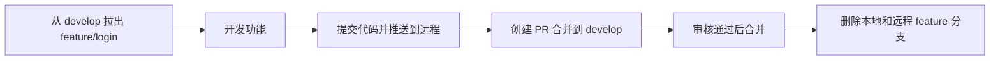
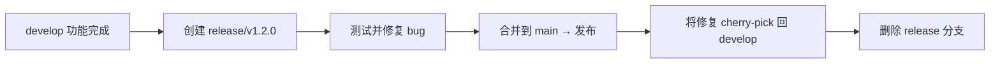
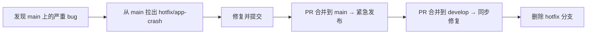
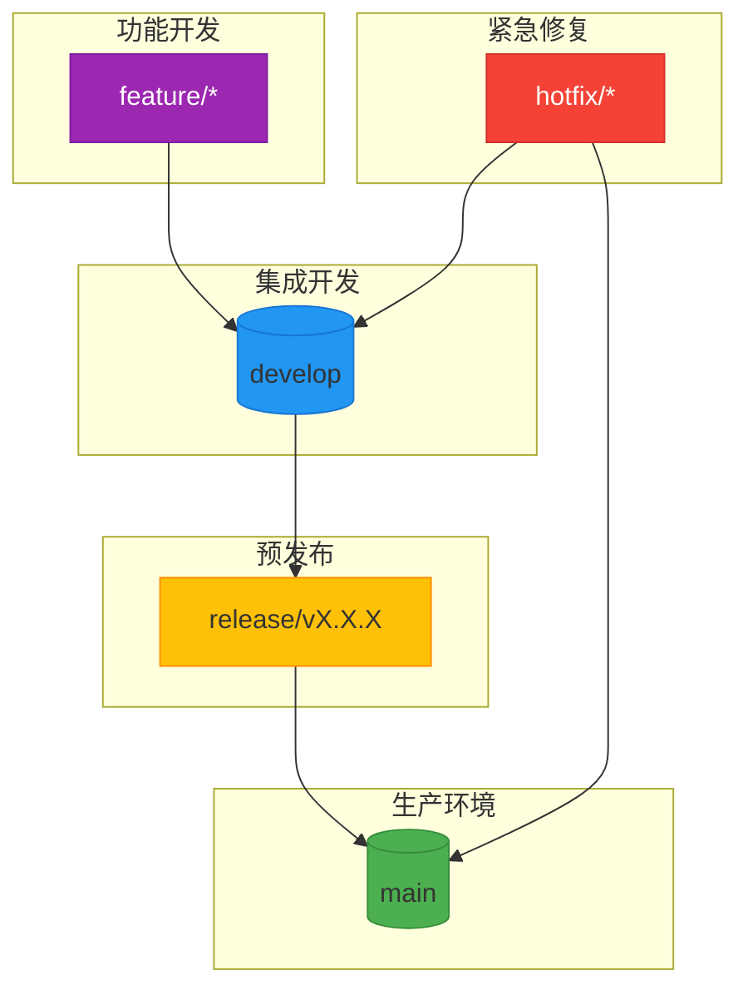

在使用 **Tauri 2** 开发桌面应用时，良好的 **分支管理策略** 是确保团队协作高效、代码质量可控、发布稳定的关键。虽然 Tauri 本身不强制任何特定的分支模型，但结合现代软件工程实践和 CI/CD 集成（如 GitHub Actions），推荐采用一种 **基于 Git 的标准化分支管理流程**。

下面为你详细介绍一个适用于 **Tauri 2 应用项目** 的典型分支管理方案，包括：

- 分支结构
- 每个分支的作用
- 权限规划建议
- 与 CI/CD 的集成方式

---

## 🌲 一、推荐分支模型：**Git Flow + Release Flow 精简版**

考虑到 Tauri 应用是 **桌面客户端软件**，通常有明确的版本发布周期（如 v1.0.0、v1.1.0），我们推荐使用 **轻量级 Git Flow** 或 **Trunk-Based Development with Release Branches** 的混合模式。

### ✅ 推荐分支结构

| 分支名 | 作用 | 是否长期存在 | 保护策略 |
|--------|------|----------------|-----------|
| `main` / `master` | 主干分支，代表生产环境最新稳定版本 | ✅ 是 | 🔒 强制保护 |
| `develop` | 开发主分支，集成所有功能 | ✅ 是 | 🔒 保护 |
| `feature/*` | 功能开发分支（如 `feature/login-ui`） | ❌ 否 | 可自由创建 |
| `release/vX.X.X` | 预发布分支，用于测试和修复 | ❌ 否 | 🔒 保护 |
| `hotfix/*` | 紧急修复分支（如 `hotfix/crash-on-startup`） | ❌ 否 | 🔒 保护 |

> 💡 注：你可以将 `main` 作为生产分支，`develop` 作为开发集成分支。

---

## 📚 二、各分支详细说明

### 1. `main`（主分支 / 生产分支）

- **作用**：
    - 代表当前线上发布的稳定版本
    - 每次发布新版本后，`release` 分支合并至此
    - 可用于触发 **自动发布更新包**（通过 GitHub Actions）
- **权限**：
    - ❌ 禁止直接 push
    - ✅ 只允许通过 **Pull Request (PR)** 合并
    - 审核要求：至少 1 人批准
    - 状态检查：CI 构建成功、代码扫描通过
- **CI/CD 集成**：
    - 推送后自动打包并生成 GitHub Release（带签名）
    - 更新 `releases.json` 供 updater 插件使用

```yaml
on:
  push:
    branches: [main]
```

---

### 2. `develop`（开发集成分支）

- **作用**：
    - 所有功能开发完成后合并到此分支
    - 每日构建（Nightly Build）的基础
    - 团队内部测试版本的来源
- **权限**：
    - ❌ 禁止直接 push
    - ✅ 必须通过 PR 合并 `feature/*` 分支
    - 建议开启自动合并（auto-merge）提高效率
- **CI/CD 集成**：
    - 每次推送生成 **开发版安装包**（如 `MyApp-Nightly.dmg`）
    - 可上传到测试渠道（如内部分享链接）

```yaml
on:
  push:
    branches: [develop]
```

---

### 3. `feature/*`（功能分支）

- **命名规范**：
    - `feature/user-auth`
    - `feature/settings-page`
    - `feature/performance-optimization`
- **作用**：
    - 开发新功能或模块
    - 每个功能独立分支，避免互相干扰
- **生命周期**：
    - 从 `develop` 分支拉出
    - 开发完成后合并回 `develop`
    - 合并后删除
- **权限**：
    - ✅ 开发者可自由创建和推送
    - 不需要保护
- **CI/CD 集成**：
    - 推送后自动运行单元测试、前端构建
    - 可选：生成预览包供测试

---

### 4. `release/vX.X.X`（发布分支）

- **命名示例**：
    - `release/v1.2.0`
    - `release/v2.0.0-beta.1`
- **作用**：
    - 准备正式发布版本
    - 只允许修复 bug，不允许新增功能
    - 可进行 QA 测试、UI 调优、文档更新
- **创建时机**：
    - 当 `develop` 分支功能完成，准备发布时
    - 从 `develop` 拉出
- **合并路径**：
    - 修复后合并回 `release` → `main`（发布）
    - 同时将修复 **cherry-pick 回 `develop`**
- **权限**：
    - ❌ 禁止直接 push
    - ✅ 必须通过 PR 合并 `hotfix/*` 或小修复
    - 保护策略同 `main`
- **CI/CD 集成**：
    - 自动生成带版本号的安装包
    - 使用正式签名证书（macOS/Windows）

```yaml
on:
  push:
    branches: 
      - 'release/*'
```

---

### 5. `hotfix/*`（紧急修复分支）

- **命名示例**：
    - `hotfix/app-crash-on-startup`
    - `hotfix/security-xss-vulnerability`
- **作用**：
    - 修复 `main` 上的严重 bug
    - 快速发布补丁版本
- **创建方式**：
    - 从 `main` 分支拉出
- **合并路径**：
    - 先合并到 `main`（快速发布）
    - 再合并到 `develop`（同步修复）
- **权限**：
    - 仅限高级开发者或负责人创建
    - PR 审核仍需进行（除非紧急情况）

---

## 🔐 三、分支权限规划建议（以 GitHub 为例）

| 分支 | 谁可以 push | 谁可以合并 PR | 是否保护 | 要求 |
|------|-------------|----------------|----------|------|
| `main` | ❌ 无人 | ✅ 团队负责人 / Tech Lead | ✅ 是 | PR + 1 人批准 + CI 通过 |
| `develop` | ❌ 无人 | ✅ 所有开发者 | ✅ 是 | PR + CI 通过 |
| `feature/*` | ✅ 开发者 | ✅ 开发者 | ❌ 否 | 自由创建 |
| `release/*` | ❌ 无人 | ✅ 架构师 / 发布经理 | ✅ 是 | PR + 2 人批准 + 签名证书 |
| `hotfix/*` | ✅ 高级开发者 | ✅ 负责人 | ✅ 是 | 紧急时可绕过部分检查 |

> ✅ 在 GitHub 中通过 **Branch Protection Rules** 设置上述规则。

---

## 🔄 四、典型开发流程示例

```bash
# 1. 从 develop 拉出功能分支
git checkout develop
git pull
git checkout -b feature/new-settings-ui

# 2. 开发完成后推送
git add .
git commit -m "feat: add new settings UI"
git push origin feature/new-settings-ui

# 3. 创建 PR 合并到 develop
# → GitHub 上创建 Pull Request

# 4. 审核通过后合并
git checkout develop
git pull

# 5. 准备发布 v1.3.0
git checkout -b release/v1.3.0
git push origin release/v1.3.0

# 6. 测试中发现 bug，修复
git checkout -b hotfix/setting-save-bug release/v1.3.0
# 修复后提交 PR 合并到 release/v1.3.0

# 7. 发布完成，合并到 main
# PR: release/v1.3.0 → main
# PR: release/v1.3.0 → develop (同步修复)
```

---

## 🧪 五、与 Tauri CI/CD 的集成建议

| 分支 | 触发动作 |
|------|---------|
| `feature/*` | 运行测试、构建前端、检查格式 |
| `develop` | 生成 Nightly 安装包，上传到测试服务器 |
| `release/*` | 使用正式签名证书打包，生成 GitHub Release（draft） |
| `main` | 发布正式版本，更新 `releases.json`，通知 updater |

> 📦 示例：`release/*` 触发签名构建
```yaml
on:
  push:
    branches: ['release/*']

jobs:
  build:
    runs-on: macos-latest
    steps:
      - uses: tauri-apps/tauri-action@v0
        with:
          release: true
          tagName: v__VERSION__
          releaseDraft: true
```

---

## ✅ 六、最佳实践总结

| 建议 | 说明 |
|------|------|
| ✅ 使用 `main` + `develop` 双主干 | 清晰分离开发与生产 |
| ✅ 功能分支粒度适中 | 避免过大或过小 |
| ✅ 所有合并走 PR | 保证代码审查 |
| ✅ 保护关键分支 | 防止误操作 |
| ✅ 自动化 CI/CD | 每个分支触发不同构建策略 |
| ✅ 使用语义化版本（SemVer） | 配合 `package.json` 和 `tauri.conf.json` |
| ✅ 文档化分支策略 | 写入 `CONTRIBUTING.md` |

---

## 📄 七、可选：支持多平台发布的分支策略

如果你的应用需要为不同客户定制版本（如企业版、社区版），可扩展分支：

- `main-community`
- `main-enterprise`
- `release-community/v1.0.0`
- `release-enterprise/v2.0.0`

并通过 CI 中的 `if` 条件区分构建流程。

---

## 📚 参考资料

- Git Flow 说明：https://nvie.com/posts/a-successful-git-branching-model/
- GitHub Branch Protection：https://docs.github.com/en/repositories/configuring-branches-and-merges-in-your-repository
- Tauri CI 示例：https://github.com/tauri-apps/tauri-action

---

如果你希望，我可以为你生成一份：
- `CONTRIBUTING.md` 模板（含分支规范）
- GitHub Branch Protection 配置 JSON
- 自动化脚本（如 `git create-feature`）

# 团队成员本地拉取到本地开发的分支是怎样的？

在使用 **Tauri 2** 进行团队协作开发时，每个团队成员在本地进行开发的流程需要遵循统一的分支规范，以确保代码合并顺畅、避免冲突、并支持高效的 CI/CD 集成。

下面为你详细介绍：**团队成员如何从远程仓库拉取代码，并在本地创建和管理开发分支**，包括完整操作流程、最佳实践和常见问题说明。

---

## 🌲 一、本地开发分支的整体流程

```text
远程仓库 (origin)
     ↑↓
本地仓库 (你的电脑)
     ↓
创建 feature 分支 → 开发功能 → 提交代码 → 推送到远程 → 创建 PR → 审核合并
```

---

## 🧭 二、标准本地开发分支操作流程（带命令示例）

### ✅ 步骤 1：克隆项目到本地（首次）

```bash
# 克隆项目（包含所有分支）
git clone https://github.com/your-team/your-tauri-app.git
cd your-tauri-app

# 配置用户名（如果未设置）
git config user.name "张三"
git config user.email "zhangsan@company.com"
```

> 🔐 建议使用 SSH 或 GitHub Token 访问私有仓库。

---

### ✅ 步骤 2：确保本地 `develop` 分支最新

```bash
# 切换到 develop 分支（假设这是开发主干）
git checkout develop

# 拉取最新代码
git pull origin develop
```

> ⚠️ 每次开始新功能前，都应确保 `develop` 是最新的，避免基于过时代码开发。

---

### ✅ 步骤 3：创建本地功能分支（feature branch）

```bash
# 从 develop 拉出一个新功能分支
git checkout -b feature/user-login-modal
```

- 分支命名建议：
    - `feature/功能描述`：如 `feature/settings-page`、`feature/file-drop-upload`
    - 使用小写字母 + 连字符
    - 避免空格或特殊字符

> 💡 这个分支只存在于你本地，尚未推送到远程。

---

### ✅ 步骤 4：开始开发 Tauri 功能

你可以进行以下开发工作：

- 修改前端（React/Vue 等）实现 UI
- 编写 Tauri command（Rust 后端逻辑）
- 调用系统 API（如文件操作、托盘、通知等）
- 测试功能（`tauri dev`）

```bash
# 启动开发服务器
bun tauri dev
# 或 npm run tauri dev
```

---

### ✅ 步骤 5：提交代码到本地仓库

```bash
# 查看修改
git status

# 添加修改的文件
git add .

# 提交代码（写清楚提交信息）
git commit -m "feat: add user login modal with email validation"
```

> ✅ 提交信息建议使用 [Conventional Commits](https://www.conventionalcommits.org/) 规范：
> - `feat:` 新功能
> - `fix:` 修复 bug
> - `docs:` 文档更新
> - `style:` 格式调整
> - `refactor:` 重构
> - `chore:` 构建或工具变更

---

### ✅ 步骤 6：将本地分支推送到远程仓库

```bash
# 第一次推送时，设置上游分支
git push -u origin feature/user-login-modal
```

> 🔁 这会：
> - 在 GitHub/GitLab 上创建同名分支
> - 建立本地分支与远程分支的跟踪关系
> - 之后可以直接用 `git push` 和 `git pull`

---

### ✅ 步骤 7：创建 Pull Request（PR）

1. 打开项目 GitHub 页面
2. 点击 “Compare & pull request”
3. 填写：
    - 标题：`Add user login modal`
    - 描述：说明功能、截图、测试方式
    - 分配 reviewer（如 Tech Lead）
    - 关联 issue（如 `closes #123`）

> 📌 PR 是代码审查（Code Review）的关键环节，确保质量与一致性。

---

### ✅ 步骤 8：同步 `develop` 的最新更改（避免冲突）

在你开发期间，其他人可能已将代码合并到 `develop`，你需要同步：

```bash
# 回到 develop 分支
git checkout develop
git pull origin develop

# 切回你的功能分支
git checkout feature/user-login-modal

# 将 develop 的更新合并进来（推荐 rebase）
git rebase develop
```

> ✅ 使用 `rebase` 而不是 `merge`，可以保持提交历史线性整洁。

如果出现冲突，解决后：

```bash
git add .
git rebase --continue
```

然后推送：

```bash
git push --force-with-lease  # 因为 rebase 改变了历史
```

> ⚠️ `--force-with-lease` 是安全的强制推送，不会覆盖他人提交。

---

### ✅ 步骤 9：PR 被合并后，清理本地分支

```bash
# 合并后，删除本地分支
git checkout develop
git pull origin develop          # 确保已包含你的更改
git branch -d feature/user-login-modal   # 删除本地分支
```

> ✅ 建议定期清理已合并的分支，保持本地整洁。

---

## 🛠️ 三、本地开发环境建议

| 项目 | 建议 |
|------|------|
| IDE | VS Code + Rust Analyzer + Tauri 插件 |
| 终端 | 使用内置终端（如 VS Code Terminal） |
| Node 版本 | 使用 `.nvmrc` 或 `package.json` 强制统一 |
| Rust 工具链 | 使用 `rust-toolchain.toml` 锁定版本 |
| 代码格式化 | 配置 Prettier + Rustfmt + pre-commit hook |

示例 `rust-toolchain.toml`：

```toml
[toolchain]
channel = "stable"
targets = ["x86_64-apple-darwin", "x86_64-pc-windows-msvc"]
```

---

## 🔐 四、权限与安全注意事项

| 说明 | 建议 |
|------|------|
| ❌ 不要直接 push 到 `main` 或 `develop` | 必须通过 PR |
| ✅ 本地分支只属于你 | 可自由修改、重置 |
| 🔒 敏感信息不要提交 | 如 `.env`、证书、密钥 |
| 📁 建议 `.gitignore` 包含：`src-tauri/target/`, `.env`, `node_modules/` |

---

## 🔄 五、典型本地分支生命周期图示

```text
远程 origin                    本地
───────────────────────────────────────────────────────
                                 
origin/main ────────────────────────┐
                                    │
origin/develop ──┬──────────────────┼───────────────┐
                 │                  │               │
                 │    git checkout  │               │
                 │    -b feature/*  │               │
                 ▼                  ▼               │
           feature/login     feature/login ────→ git add/commit
                                                   │
                                                   │ git push -u
                                                   ▼
                                   origin/feature/login
                                           ↑
                                           │ 创建 PR
                                           ▼
                                 PR 审核 → 合并到 develop
                                           │
                                           ▼
                                 git pull origin develop
                                 git branch -d feature/login
```

---

## 📚 六、常见问题与解决方案

| 问题 | 解决方案 |
|------|----------|
| ❌ 提交了敏感信息怎么办？ | 使用 `git reset` + `git commit --amend`，或 `BFG Repo-Cleaner` |
| ❌ 分支冲突太多？ | 经常 `git rebase develop`，小步提交 |
| ❌ `git push --force` 被拒？ | 使用 `--force-with-lease`，或联系管理员 |
| ❌ 不知道当前在哪分支？ | `git branch` 或 `git status` |
| ❌ 想放弃本地修改？ | `git reset --hard`（慎用）或 `git checkout .` |

---

## ✅ 七、总结：团队成员本地开发分支规范

| 项目 | 规范 |
|------|------|
| 基于哪个分支创建 | `develop` |
| 分支命名 | `feature/功能描述`（小写+连字符） |
| 提交频率 | 小步提交，每次提交一个逻辑变更 |
| 提交信息 | 使用 `feat:`, `fix:` 等 Conventional Commits |
| 推送方式 | `git push -u origin 分支名` |
| 同步主干 | `git rebase develop` |
| PR 要求 | 必须有描述、截图、关联 issue |
| 合并后清理 | 删除本地和远程分支 |

---

## 📄 附：推荐脚本（可加入 `package.json`）

```json
{
  "scripts": {
    "create-feature": "read -p 'Feature name: ' name && git checkout develop && git pull && git checkout -b feature/$name",
    "sync-develop": "git checkout develop && git pull && git checkout - && git rebase develop"
  }
}
```

运行：

```bash
npm run create-feature   # 输入 login-modal
npm run sync-develop     # 同步 develop 最新代码
```

---

如果你希望，我可以为你生成：
- 一份 `CONTRIBUTING.md` 模板
- Git 别名配置（如 `git co` → `checkout`）
- 自动化分支创建脚本（Shell/PowerShell）

# 请给出一个Tauri2分支的关系梳理图

当然可以！以下是一个 **清晰、专业的 Tauri 2 应用项目分支关系梳理图（Branching Strategy Diagram）**，配合详细说明，帮助你和团队理解各分支的职责、流向与协作方式。

---

## 🌲 Tauri 2 项目分支关系图（文字版 + 结构说明）

```
                                  ┌─────────────────────┐
                                  │     main            │ ← 生产环境版本
                                  │ (Production)        │    每次发布后指向新版本
                                  └─────────┬───────────┘
                                            │ ▲
                                            │ │ 合并发布
                                            ▼ │
                                  ┌─────────────────────┐
                                  │   release/vX.X.X    │ ← 预发布/测试版本
                                  │ (Release Candidate) │    用于 QA 测试、修复 bug
                                  └─────────┬───────────┘
                                            │ ▲
                    ┌───────────────────────┘ │ 合并功能/修复
                    │                         │
                    ▼                         │
           ┌────────────────────┐             │
           │     develop        │ ◀───────────┘
           │ (Integration)      │    从 release 分支 cherry-pick 修复
           └─────────┬──────────┘
                     │ ▲
         合并功能    │ │ 推荐 rebase 同步
                    ▼ │
    ┌─────────────────────────────────┐
    │ feature/user-login              │
    │ feature/settings-ui             │ ← 功能开发分支（每个功能一个）
    │ feature/file-dialog             │    从 develop 拉出，完成后合并回 develop
    │ ...                             │
    └─────────────────────────────────┘

    ┌─────────────────────────────────┐
    │ hotfix/crash-on-startup         │ ← 紧急修复分支
    │ hotfix/security-xss             │    从 main 拉出，修复后合并回 main 和 develop
    └─────────────────────────────────┘
```

---

## 📊 分支关系说明表

| 分支 | 类型 | 来源 | 目标 | 用途 | 是否长期存在 | 权限 |
|------|------|-------|--------|------|----------------|--------|
| `main` | 主干 | `release/*` | —— | 生产环境稳定版本 | ✅ 是 | 🔒 仅 PR 合并 |
| `release/vX.X.X` | 发布 | `develop` | `main`, `develop` | 预发布测试、版本冻结 | ❌ 否 | 🔒 保护 |
| `develop` | 开发主干 | `main`（初始） | `release/*`, `feature/*` | 集成所有功能 | ✅ 是 | 🔒 仅 PR 合并 |
| `feature/*` | 功能 | `develop` | `develop` | 开发新功能 | ❌ 否 | ✅ 自由创建 |
| `hotfix/*` | 紧急修复 | `main` | `main`, `develop` | 修复生产环境严重 bug | ❌ 否 | 🔒 保护 |

---

## 🔁 分支流转流程（生命周期）

### 1. **功能开发流程**


### 2. **版本发布流程**


### 3. **紧急修复流程**


---

## 🧩 与 Tauri CI/CD 的集成关系

| 分支 | 触发动作 | 构建产物 | 签名 | 发布目标 |
|------|----------|-----------|--------|------------|
| `feature/*` | ✅ 构建前端、运行测试 | 无安装包 | ❌ | 仅 CI 检查 |
| `develop` | ✅ 构建 Nightly 版 | `MyApp-Nightly.dmg/.msi` | ⚠️ 可选测试签名 | 内部测试链接 |
| `release/*` | ✅ 构建 RC 版 | `MyApp-v1.2.0-rc.1.dmg` | ✅ 正式证书 | GitHub Release（Draft） |
| `main` | ✅ 构建正式版 | `MyApp-v1.2.0.dmg` | ✅ 正式证书 | GitHub Release（Published） + `releases.json` |

---

## 🖼️ 可视化建议（你可以在文档中插入的图表）

如果你使用 **Mermaid.js**（支持 Markdown 的工具如 Typora、Obsidian、GitHub Wiki），可以插入如下代码生成图表：



> 📌 将以上代码粘贴到支持 Mermaid 的编辑器中，即可生成彩色分支关系图。

---

## ✅ 最佳实践总结

| 原则 | 说明 |
|------|------|
| 🌿 永远不在 `main` 或 `develop` 上直接开发 | 必须通过 `feature` 分支 |
| 🔁 经常同步 `develop` 到 `feature` 分支 | 使用 `git rebase develop` |
| 🧼 功能完成后及时删除分支 | 保持仓库整洁 |
| 📦 每个 `release` 对应一个版本 | 便于回滚和维护 |
| 🛡️ 所有分支启用保护规则 | 防止误操作 |
| 🤖 与 GitHub Actions 深度集成 | 实现自动化构建与发布 |

---

## 📄 输出建议

你可以将此分支关系图放入以下文档中：

- `docs/branching-strategy.md`
- `CONTRIBUTING.md`
- 团队内部 Wiki
- 项目 README 的 “开发规范” 部分

---

如果你希望，我可以为你生成：
- 一份完整的 `CONTRIBUTING.md` 模板
- Mermaid 图表的 PNG/SVG 导出版本
- Git 分支管理脚本（自动创建/同步/删除分支）

欢迎继续提问！